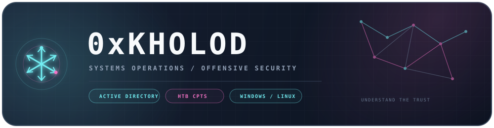

  

  
  &nbsp;
  
  &nbsp;
  

  
  

## `whoami`

<h3 align="center">Systems Administrator moving deeper into offensive security.</h3>

Grounded in Windows, Linux, and Active Directory — learning how systems establish trust, then testing where that trust breaks.

## `credentials`

  

## `projects`

  
  &nbsp;
  

 
 

<picture>
  <source media="(prefers-color-scheme: dark)" srcset="https://raw.githubusercontent.com/0xkholod/0xkholod/output/pacman-contribution-graph-dark.svg" />
  <source media="(prefers-color-scheme: light)" srcset="https://raw.githubusercontent.com/0xkholod/0xkholod/output/pacman-contribution-graph.svg" />
  
</picture>
